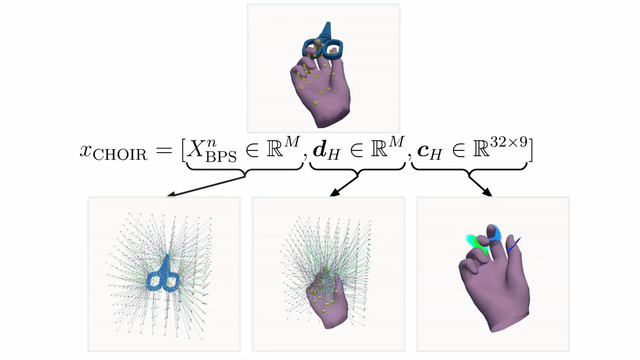

 

  <h1 align="center">CHOIR: a Versatile and Differentiable Hand-Object Interaction Representation</h1>
  

    <a href="https://theomorales.com"><strong>Theo Morales</strong></a>
    ·
    <a href="https://otaheri.github.io/"><strong>Omid Taheri</strong></a>
    ·
    <a href="https://www.maynoothuniversity.ie/faculty-science-engineering/our-people/gerard-lacey"><strong>Gerard Lacey</strong></a>
  

  <h4 align="center">WACV 2025</h4>

  

    <!--    -->
    
    
  

  

    
  

<h1>The code will be cleaned up soon and models will be uploaded!</h1>
